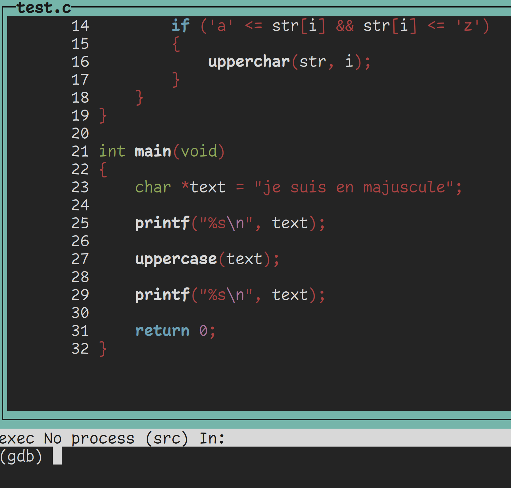
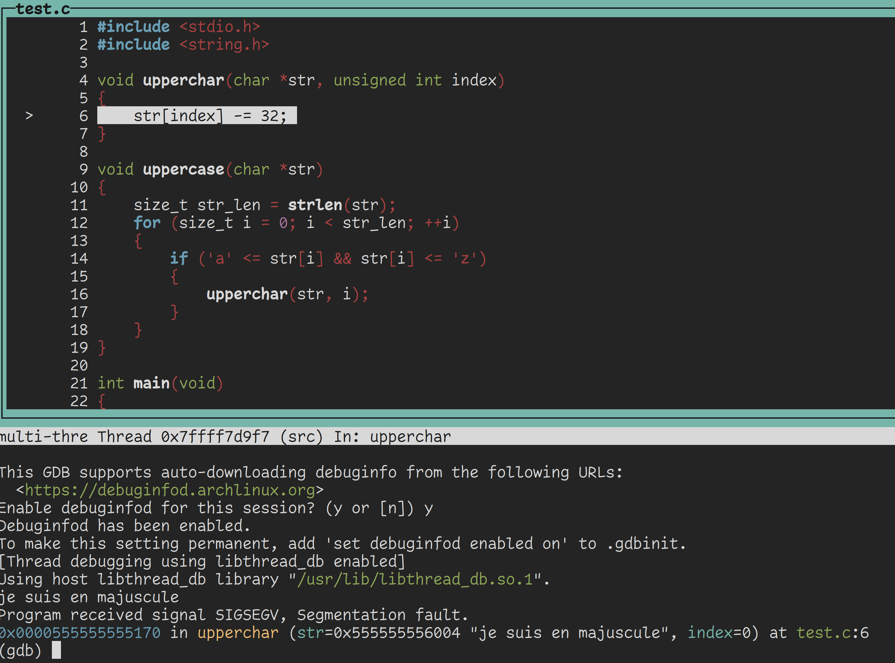
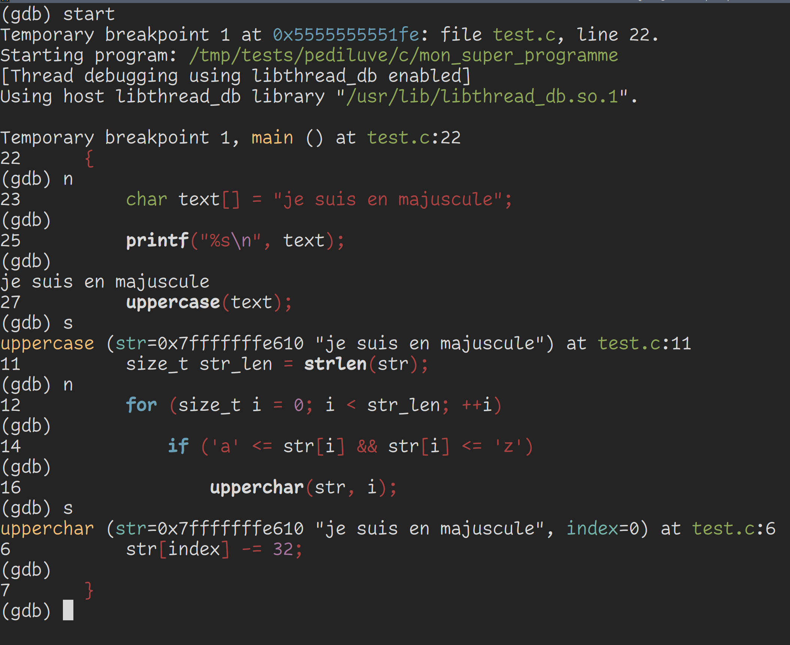

# GDB

GDB signifie **G**nu **D**e**B**ugger. C'est un débogueur qui te permet de voir
plus en profondeur comment s'exécute ton programme, remonter la trace des bugs,
etc.

Je ne vais pas te montrer tout l'envers du décort avec gdb, ça serait beaucoup
trop long et ça mériterait un livre complet. Je vais plutôt te montrer quelques
commandes de bases qui te seront déjà bien utiles.

## Symbole de débug

Si tu veux utiliser GDB, je te conseille de **toujours** inclure les symboles de
débug.


## Exemples

Voici le code que l'on va déboguer.

```c
#include <stdio.h>
#include <string.h>

void upperchar(char *str, unsigned int index)
{
    str[index] -= 32; 
}

void uppercase(char *str)
{
    size_t str_len = strlen(str);
    for (size_t i = 0; i < str_len; ++i)
    {
        if ('a' <= str[i] && str[i] <= 'z')
        {
            upperchar(str, i);
        }
    }
}

int main(void)
{
    char *text = "je suis en majuscule";

    printf("%s\n", text);

    uppercase(text);

    printf("%s\n", text);

    return 0;
}
```

```c
$ ./mon_super_programme
je suis en majuscule
segmentation fault (core dumped)  ./mon_super_programme
$
```

### Exécution

```text
$ gcc test.c -g -o mon_super_programme
$
```

Pour déboguer ton programme, appelle gdb avec le nom de ton exécutable.

```text
$ gdb mon_super_programme
GNU gdb (GDB) 15.1
Copyright (C) 2024 Free Software Foundation, Inc.
License GPLv3+: GNU GPL version 3 or later <http://gnu.org/licenses/gpl.html>
This is free software: you are free to change and redistribute it.
There is NO WARRANTY, to the extent permitted by law.
Type "show copying" and "show warranty" for details.
This GDB was configured as "x86_64-pc-linux-gnu".
Type "show configuration" for configuration details.
For bug reporting instructions, please see:
<https://www.gnu.org/software/gdb/bugs/>.
Find the GDB manual and other documentation resources online at:
    <http://www.gnu.org/software/gdb/documentation/>.

For help, type "help".
Type "apropos word" to search for commands related to "word"...
/home/gelules/.config/gdb/gdbinit:1: Error in sourced command file:
No symbol table is loaded.  Use the "file" command.
Reading symbols from mon_super_programme...
(gdb)
```

Tu peux lire que GDB a bien charger ton programme, et tu as maintenant un
prompt.

Si tu veux quitter GDB, exécuter **exit** ou effecute la combinaison de touches
**ctrl+d**. Si tu es en débug, il se peut que tu dois faire cette manipulation deux fois
d'affilées.

### Afficher le code source

Ceci fonctionne avec les codes compilés avec les symboles de débug.

```text
(gdb) tui enable
```



Si tu utilises les touches fléchées, tu parcouras le code. Mais GDB te permet
avec les touches fléchées de parcourir ton historique de commandes.

Pour te refocaliser sur la fenêtre des commandes, exécute

```text
(gdb) foc cmd
```

Pour refocaliser le code source, exécute

```text
(gdb) foc src
```

### Exécuter le programme

Pour exécuter le programme normalement dans GDB, exécute **run** ou **r** pour
aller plus vite.

Si GDB te demande de télécharger et activer debuginfo, répond yes. Ca ne te sera
pas utile maintenant, mais ça te fait des informations de débug supplémentaires.
Ce n'est pas négligeable.

```text
(gdb) run
...
je suis en majuscule

Program received signal SIGSEGV, Segmentation fault.
0x0000555555555170 in upperchar (str=0x555555556004 "je suis en majuscule", index=0) at test.c:6
6	    str[index] -= 32;
(gdb)
```



GDB t'indique que le segfault a lieu dans la fonction **upperchar** à la ligne
6, et te met en surbrillance la ligne exécutée qui segfault. Elle t'affiche
aussi les paramètres de la fonction.

### Backtrace

Tu peux utiliser la commande **backtrace** ou **bt** pour aller plus vite pour
voir où tu es et d'où tu viens.

```text
(gdb) backtrace
#0  0x0000555555555170 in upperchar (str=0x555555556004 "je suis en majuscule", index=0) at test.c:6
#1  0x00005555555551d3 in uppercase (str=0x555555556004 "je suis en majuscule") at test.c:16
#2  0x0000555555555211 in main () at test.c:27
(gdb)
```

Ca se lit de bas en haut.

Tu étais dans le main, à la ligne 27 tu as appelé uppercase et à la ligne 16 tu
as appelé upperchar avec l'index à 0.

str n'est pas à NULL (0x0), elle est à l'adresse 0x555555556004 et on voit
qu'elle pointe vers une chaîne de caractères qui contient notre texte.

Tu devines que tu n'as pas le droit de mofidier **str**.

Retournons dans le main.


```c
    char *text = "je suis en majuscule";
```

Rappelle toi, tu n'as pas le droit de modifier un pointeur sur un **string
literal**, tu dois créer un tableau pour ça.

Fixons ça avec :

```c
    char text[] = "je suis en majuscule";
```

```text
$ ./mon_super_programme
je suis en majuscule
JE SUIS EN MAJUSCULE
$
```

Hourra ! Ca fonctionne !

Je vais quand même te montrer quelques commandes qui pourraient s'avérer utiles.

### start

La commande **start** crée un **breakpoint**, un point d'arrêt, au tout début de
ton programme. Ca te permet de commencer à déboguer ton programme en restant au
début pour faire de la vérification avec de **continuer** l'exécution


### continue

Quand tu es dans un breakpoint, le programme est à l'arrêt. Utilise la commande
**continue** ou **c** pour aller plus vite pour reprendre le cours d'exécution.

### breakpoints

Tu peux créer des breakpoints avec la commande **break** ou **break** pour
aller plus vite, suivi d'une adresse mémoire, d'un nom de fonction ou d'un
numéro de ligne.

Sache que GDB autorise l'autocomplétion, si tu mets un début de nom de fonction,
il peut autocompléter en appuyant sur la touche de tabulation.

Dans le code que j'ai donné au début. Si je fais

```text
(gdb) break upperchar
Breakpoint 1 at 0x1164: file test.c, line 6.
(gdb)
```

J'ai bien un breakpoint qui se fera à la fonction upperchar.

Pour lister les breakpoints, tu peux exécuter la commande **info breakpoints**.

```text
(gdb) info breakpoints
Num     Type           Disp Enb Address            What
1       breakpoint     keep y   0x0000000000001164 in upperchar at test.c:6
(gdb)
```

### next et step

Si tu veux avancer pas à pas, tu peux utiliser les commandes **next** ou **n**
pour aller plus vite, et **step** ou **s** pour aller plus vite.

**next** ne rentre pas dans une fonction pendant le débug, gdb exécutera tout le
code qui doit s'y exécuter en gardant le focus sur la fonction dans laquelle tu
es.

**step** rentre dans la fonction

Si tu appuies sur Entrée alors que le prompt est vide, GDB rééexuctera ta
dernière commande.

La ligne de code que GDB affiche sera la ligne qui **sera** exécutée une fois 
que tu entreras **next** ou **step**.

```text
(gdb) start
Temporary breakpoint 1 at 0x5555555551fe: file test.c, line 22.
Starting program: /tmp/tests/pediluve/c/mon_super_programme
[Thread debugging using libthread_db enabled]
Using host libthread_db library "/usr/lib/libthread_db.so.1".

Temporary breakpoint 1, main () at test.c:22
22	{
(gdb) n
23	    char text[] = "je suis en majuscule";
(gdb)
25	    printf("%s\n", text);
(gdb)
je suis en majuscule
27	    uppercase(text);
(gdb) s
uppercase (str=0x7fffffffe610 "je suis en majuscule") at test.c:11
11	    size_t str_len = strlen(str);
(gdb) n
12	    for (size_t i = 0; i < str_len; ++i)
(gdb)
14	        if ('a' <= str[i] && str[i] <= 'z')
(gdb)
16	            upperchar(str, i);
(gdb) s
upperchar (str=0x7fffffffe610 "je suis en majuscule", index=0) at test.c:6
6	    str[index] -= 32;
(gdb)
7	}
(gdb)
```



### Exécuter son programme avec des arguments sur argv

Si tu dois exécuter ton programme avec des arguments, exécute gdb normalement en
donnant le nom du programme. Une fois dans le prompt de GDB, exécute

```text
(gdb) start argument_1 argument_2 argument_3
```

ou

```text
(gdb) run argument_1 argument_2 argument_3
```

pour lancer le débug avec des arguments.
