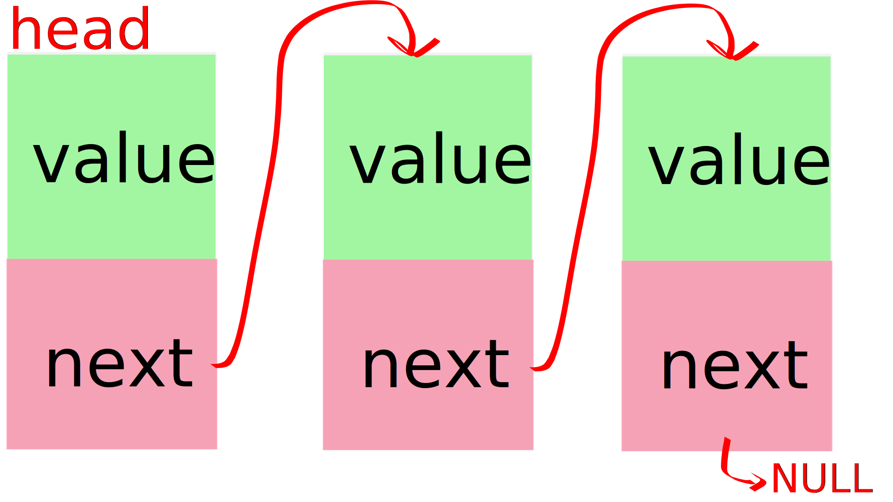

# Listes chainées

Pour voir un ensemble d'exercices avancés, tu vas apprendre à utiliser les
listes chaînées. C'est une structure de données avancée (par rapport aux
tableaux, par exemple).

Une liste chaînée est juste une structure qui a en attribut un pointeur sur sa
propre structure.

Voici un bout de code pour mieux se rendre compte.

```c
struct node
{
    int value;
    struct node *next;
};
```

Ainsi notre noeud peut aller dans une autre zone mémoire en pointant sur un
autre noeud qui aura d'autres valeurs, et ainsi de suite.

L'intérêt est que tu vas pouvoir ajouter un noeud quand bon te semble
dynamiquement.

Voici une représentation d'une liste chaînée.



Chaque rectangle coloré en vert et rose est un noeud. Le premier est appelé
**head** car il est en tête de la liste. On sait que le dernier est en fin de
liste car son attribut **next** est à **NULL**.

Pour passer au noeud d'après, on utilise l'attribut **next**.

Commençons par créer une fonction pour créer un noeud avec une valeur envoyée en
paramètre. Maintenant que tu sais utiliser **malloc**, tu ne seras pas surpris
de le voir utilisé dans la fonction.

```c
#include <stdlib.h>

struct node
{
    int value;
    struct node *next;
};

struct node *node_constructor(int value)
{
    struct node *new = malloc(sizeof (struct node));
    if (new == NULL)
    {
        return NULL;
    }

    new->value = value;
    new->next = NULL;

    return new;
}
```

Fais bien attention à mettre **next** à **NULL**. On va s'en servir pour
parcourir la liste chaînée. On saura que nous sommes à la fin une fois que le
dernier noeud aura son **next** à **NULL**.

```c
#include <stdio.h>
#include <stdlib.h>

struct node
{
    int value;
    struct node *next;
};

struct node *node_constructor(int value)
{
    struct node *new = malloc(sizeof (struct node));
    if (new == NULL)
    {
        return NULL;
    }

    new->value = value;
    new->next = NULL;

    return new;
}

int main(void)
{
    struct node *head = node_constructor(69);
    void *ptr_next = head->next;

    printf("head value: %d\n", head->value);
    printf("head next : %p\n", next);

    return 0;
}
```

La variable **ptr_next** m'est juste utile pour afficher dans printf ce que vaut
**head->next**. En temps normal tu n'as pas besoin de faire ça.

```text
$ ./mon_super_programme
head value: 69
head next : (nil)
$
```

**(nil)** est une écriture particulière de printf pour signifier que la valeur
de l'adresse à affcher est **NULL**.

Tu peux maintenant enchaîner les appels.

```c
#include <stdio.h>
#include <stdlib.h>

struct node
{
    int value;
    struct node *next;
};

struct node *node_constructor(int value)
{
    struct node *new = malloc(sizeof (struct node));
    if (new == NULL)
    {
        return NULL;
    }

    new->value = value;
    new->next = NULL;

    return new;
}

int main(void)
{
    struct node *head = node_constructor(69);

    head->next = node_constructor(51);
    head->next->next = node_constructor(2600);
    head->next->next->next = node_constructor(42);

    printf("1: %d\n", head->value);
    printf("2: %d\n", head->next->value);
    printf("3: %d\n", head->next->next->value);
    printf("4: %d\n", head->next->next->next->value);

    return 0;
}
```

```text
$ ./mon_super_programme
1: 69
2: 51
3: 2600
4: 42
$
```

Et si tu faisais plutôt une fonction pour parcourir et afficher ta liste chaînée
?

Tu as deux moyen pour ça. Une fonction itérative qui utilise une boucle, et une
fonction récursive qui se rappelle elle-même.

```c
#include <stdio.h>
#include <stdlib.h>

struct node
{
    int value;
    struct node *next;
};

struct node *node_constructor(int value)
{
    struct node *new = malloc(sizeof (struct node));
    if (new == NULL)
    {
        return NULL;
    }

    new->value = value;
    new->next = NULL;

    return new;
}

void node_printer_rec(struct node *n)
{
    if (n == NULL)
    {
        return;
    }

    printf("%d\n", n->value);

    node_printer_rec(n->next);
}

void node_printer_loop(struct node *n)
{
    while (n != NULL)
    {
        printf("%d\n", n->value);
        n = n->next;
    }
}

int main(void)
{
    struct node *head = node_constructor(69);

    head->next = node_constructor(51);
    head->next->next = node_constructor(2600);
    head->next->next->next = node_constructor(42);

    printf("Recursif:\n");
    node_printer_rec(head);

    printf("Loop:\n");
    node_printer_loop(head);

    return 0;
}
```

```text
$ ./mon_super_programme
Recursif:
69
51
2600
42
Loop:
69
51
2600
42
$
```

On va garder la façon de faire avec la boucle. Elle est plus efficace et rapide
que la récursive qui doit se rappeler à chaque fois.

En se basant sur cette technique, code une fonction **node_append** qui prend en
paramètre la **head** de la liste chaînée et la nouvelle **value** et ajoute à
la toute fin le nouveau neud avec la valeur.

ps: Tu peux tout à faire utiliser **node_constructor** pour ça.

```c
#include <stdio.h>
#include <stdlib.h>

struct node
{
    int value;
    struct node *next;
};

struct node *node_constructor(int value)
{
    struct node *new = malloc(sizeof (struct node));
    if (new == NULL)
    {
        return NULL;
    }

    new->value = value;
    new->next = NULL;

    return new;
}

void node_append(struct node *head, int value)
{
    if (head == NULL)
    {
        return;
    }

    while (head->next != NULL)
    {
        head = head->next;
    }

    head->next = node_constructor(value);
}

void node_printer(struct node *n)
{
    while (n != NULL)
    {
        printf("%d\n", n->value);
        n = n->next;
    }
}

int main(void)
{
    struct node *head = node_constructor(69);

    node_append(head, 51);
    node_append(head, 2600);
    node_append(head, 42);

    node_printer(head);

    return 0;
}
```

Comme dans le **node_printer**, je vais parcourir la liste. Une fois arrivé au
dernier noeud qui n'a pas de **next**, je dis que son **next** est construit en
utilisant la fonction **node_constructor**.

Au cas où quelqu'un fait n'importe quoi avec ma fonction ou si je suis fatigué,
je vérifie quand même qu'on ne m'envoie pas une fonction inexistante, c'est à
dire avec la **head à NULL**, car je ne peux pas ajouter un noeud à rien.

```text
$ ./mon_super_programme
69
51
2600
42
$
```

C'est bien. Il ne manque qu'une chose... **LIBERER LA MEMOIRE !**

```text
$ valgrind ./mon_super_programme
...
==9266== HEAP SUMMARY:
==9266==     in use at exit: 64 bytes in 4 blocks
==9266==   total heap usage: 5 allocs, 1 frees, 1,088 bytes allocated
==9266==
==9266== LEAK SUMMARY:
==9266==    definitely lost: 16 bytes in 1 blocks
==9266==    indirectly lost: 48 bytes in 3 blocks
==9266==      possibly lost: 0 bytes in 0 blocks
==9266==    still reachable: 0 bytes in 0 blocks
==9266==         suppressed: 0 bytes in 0 blocks
...
$
```

Tu vas créer une fonction **node_destructor** qui prend en paramètre un **double
pointeur** sur la head de type **struct node**, libère chaque noeud et met la
valeur de head à NULL **pour de bon**.

Attention à ne pas écrire quelque chose comme ceci :

```c
while (node)
{
    free(node);
    node = node->next;
}
```

Si tu veux accéder à l'attribut d'une struct en ayant un double pointeur,
utilise cette notation :

```c
(*node)->value;
```

Les parenthèses te servent à bien déréférencer node et pas node-value.

Une fois que tu as libérer une zone mémoire, tu ne dois plus l'utiliser.

Réfléchis à utiliser une deuxième variable.

```c
#include <stdio.h>
#include <stdlib.h>

struct node
{
    int value;
    struct node *next;
};

struct node *node_constructor(int value)
{
    struct node *new = malloc(sizeof (struct node));
    if (new == NULL)
    {
        return NULL;
    }

    new->value = value;
    new->next = NULL;

    return new;
}

void node_append(struct node *head, int value)
{
    if (head == NULL)
    {
        return;
    }

    while (head->next != NULL)
    {
        head = head->next;
    }

    head->next = node_constructor(value);
}

void node_destructor(struct node **head)
{
    if (head == NULL || *head == NULL)
    {
        return;
    }

    struct node *sentinel = *head->next;
    struct node *to_free = NULL;

    while (sentinel != NULL)
    {
        to_free = sentinel;
        sentinel = sentinel->next;
        free(to_free);
    }

    free(*head);
    *head = NULL;
}

void node_printer(struct node *n)
{
    while (n != NULL)
    {
        printf("%d\n", n->value);
        n = n->next;
    }
}

int main(void)
{
    struct node *head = node_constructor(69);

    node_append(head, 51);
    node_append(head, 2600);
    node_append(head, 42);

    node_printer(head);

    node_destructor(&head);

    return 0;
}
```

```text
$ ./mon_super_programme
69
51
2600
42
$
```

```text
$ valgrind ./mon_super_programme
==9462== HEAP SUMMARY:
==9462==     in use at exit: 0 bytes in 0 blocks
==9462==   total heap usage: 5 allocs, 5 frees, 1,088 bytes allocated
==9462==
==9462== All heap blocks were freed -- no leaks are possible
$
```

Super ! Tu sais maintenant créer une liste chaînée et faire les actions les plus
basiques !

Réfléchis maintenant à faire les fonctions suivantes :

Je ne donne par les corrections car il s'agit d'exercices très souvent présents
aux piscines (et qui sont notés) auxquels tu dois réfléchir par toi-même.

```c
struct node
{
    int value;
    struct node *next;
};

/*
    Ajoute un noeud en remplaçant la tête.
    Retourne la nouvelle tête qui vient d'être ajoutée.

     head : [51 -> 42 -> NULL]

    node_insert(head, 69);

     head : [69 -> 51 -> 42 -> NULL]
*/
    struct node *node_prepend(struct node *head, int value);

/*
    Ajoute un nouveau noeud avec la valeur 'value' à l'indexième position

    Index :  0     1     2
     head : [69 -> 51 -> 42 -> NULL]

    node_insert(head, 2600, 42);

    Index :  0     1     2       3
     head : [69 -> 51 -> 2600 -> 42 -> NULL]
*/
    void node_insert(struct node *head, int value, unsigned int index);

/*
    Renvoie l'index dans la liste du premier noeud qui contient la valeur
    'value'
*/

    unsigned int node_find(struct node *head, int value);

/*
    Supprime le premier noeud dont on rencontre la valeur 'value'
    Raccroche le noeud précédent avec le noeud suivant

    head : [69 -> 51 -> 42 -> 51 -> NULL]

    node_remove(head, 51);

    head : [69 -> 42 -> 51 -> NULL]
*/
    void node_remove(struct node *head, int value);

/*
    Ajoute la deuxième liste à la suite de la première liste

    head1 : [69 -> 51 -> NULL]
    head2 : [42 -> 2600 -> 51 -> NULL]

    node_concat(head1, head2);

    head1 : [69 -> 51 -> 42 -> 2600 -> 51 -> NULL]
    head2 : [42 -> 2600 -> 51 -> NULL]
*/
    void node_concat(struct node *head1, struct node *head2);

/*
    Trie la liste dans l'ordre croissant

    head : [69 -> 51 -> 42 -> 2600 -> 51 -> NULL]

    node_sort(head);

    head : [42 -> 51 -> 51 -> 69 -> 2600 -> NULL]

*/
    void node_sort(struct node *head);

/*
    Inverse l'ordre des éléments de la liste et retourne la nouvelle tête

    head : [69 -> 51 -> 42 -> 2600 -> 51 -> NULL]

    node_reverse(head);

    head : [51 -> 2600 -> 42 -> 51 -> 69 -> NULL]
*/
    struct node *node_reverse(struct node *head);

/*
    Coupe la liste en deux à partir de l'indexième position
    La première liste aura NULL à partir de la coupure

    Retourne la tête de la seconde liste

    Index :  0     1     2       3
     head : [69 -> 51 -> 2600 -> 42 -> NULL]

    struct node *head2 = node_split(head, 1);

    head1 : [69 -> 51 -> NULL]
    head2 : [2600 -> 42 -> NULL]
*/

    struct node *node_split(struct list *head, unsigned int index);
```
