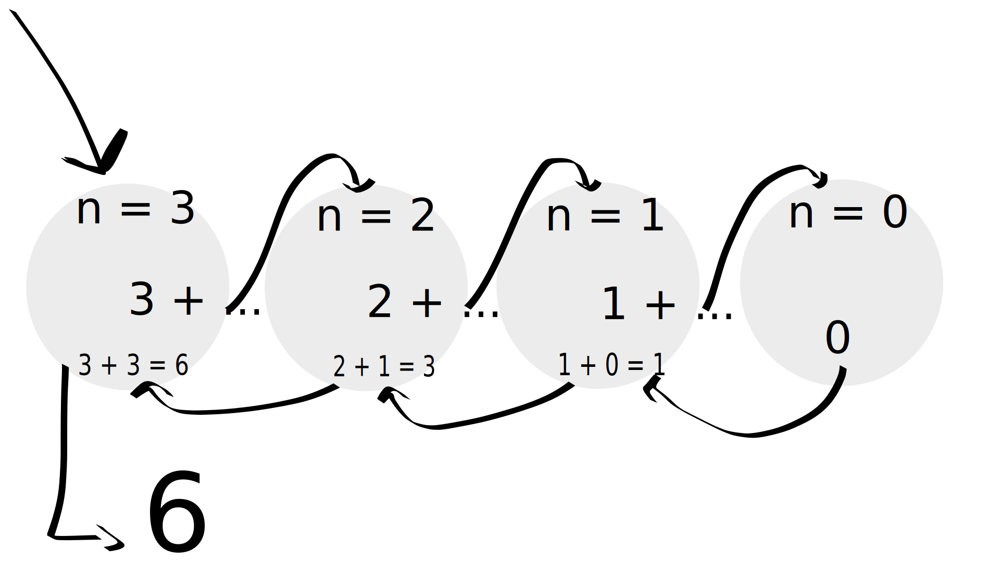

# Récursivité

Avais-tu pensé à appeler la fonction dans laquelle tu étais ?

Voici un exemple :

```c
unsigned int mystery(unsigned int n)
{
    if (n == 0)
        return 0;

    return n + mystery(n - 1);
}
```

Arrives-tu à déterminer ce que fait cette fonction ?

Elle somme l'ensemble des nombres dans l'intervalle [0;n].

En effet, la fonction va sans cesse se rappeler en décrémentant n de 1 jusqu'à
arriver à 0.

Voilà ce qu'il se passe en mémoire avec **n = 3**.



\\[ 3 + 2 + 1 + 0 = 6 \\]

Tu verras pendant ta Piscine d'autres cas d'utilisation de la récursivité. Sache
que c'est utile pour résoudre des gros problèmes en découpant un problème en
sous-problème et en itérant dessus.

La récursivité a l'avantage d'être plus élégante mais a le défaut d'être plus
lente qu'une boucle à l'exécution car à chaque rappel de la fonction, se créé en
mémoire tout le contexte nécessaire pour créer une fonction, et à la fin de la
récursion, il faut remonter tous les appels effectués pour revenir au point de
départ. Si tu fais des récursions sur des milliers et milliers de nombres, tu
perdras rapidement en efficacité.

Voici par exemple, la [fonction d'Ackermann](https://fr.wikipedia.org/wiki/Fonction_d%27Ackermann) :

```c
#include <stdlib.h>
#include <stdio.h>

int ackermann(int m, int n)
{
    if (m == 0)
    {
        return n + 1;
    }

    if (m > 0 && n == 0)
    {
        return ackermann(m - 1, 1);
    }

    if (m > 0 && n > 0)
    {
        return ackermann(m - 1, ackermann(m, n - 1));
    }
}


int main(int argc, char *argv[])
{
    if (argc != 3)
        return 1;

    int m = atoi(argv[1]);
    int n = atoi(argv[2]);
    int a = ackermann(m, n);

    printf("ackermann(%d, %d) = %d\n", m, n, a);

    return 0;
}
```

```text
$ gcc test.c -o mon_super_programme
$ time ./mon_super_programme 3 14
ackermann(3, 14) = 131069
./ackermann 3 14  69.22s user 0.56s system 98% cpu 1:10.59 total
$
```
La fonction met 69 secondes à s'exécuter sur ma machine.
