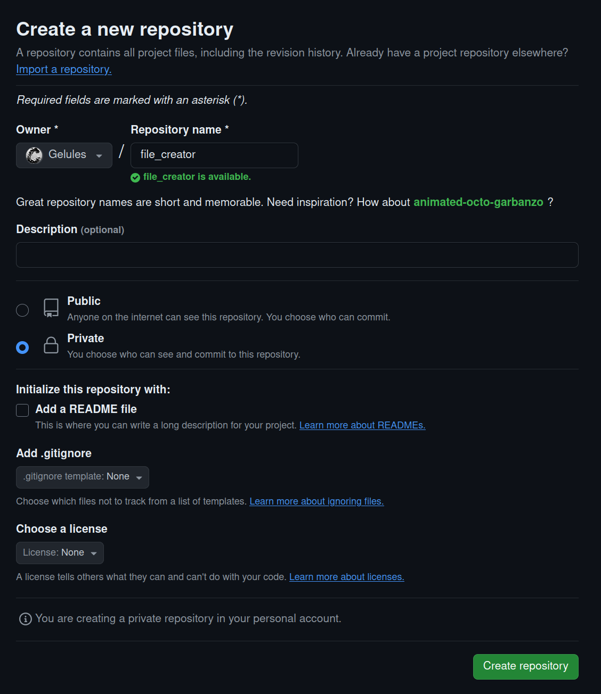

# Cas pratique avec GitHub

Le but de git, c'est de sauvegarder chaque nouvelle fonctionnalité de ton projet
dans un commit. Des que tu ajoutes quelque chose, que tu l'as testé et qu'il
fonctionne, alors tu fais un commit.

Et si tu utilises une remote, alors tu veux en plus **pousser** tes sauvegardes
dessus.

Tu vas ici apprendre à utiliser git avec GitHub.

## Création du compte

Tout d'abord, crée un compte sur [GitHub](https://github.com)

## Clés SSH

Pour que tu puisses utiliser ton dépôt, tu dois créer des clés SSH. Tu vas créer
deux clés, une clé privée, qui comme son nom l'indique doit rester privée, et
une clé publique, que tu peux montrer à tout le monde.

Quand tu installeras ta clé publique sur GitHub, il y aura une opération
cryptographique entre ta clé privée et la clé publique pour assurer que tu as
les droits de pousser ton travail sur GitHub.

Ca semble compliqué dit comme ça, ne t'inquiète pas, tout est transparant pour
toi, tu n'auras rien à faire une fois que tout est installé.

Va dans ton **HOME** et crée le répertoire **.ssh**. Dedans, crée les clés SSH.

```text
$ cd
$ mkdir .ssh
$ cd .ssh
$ ssh-keygen -t ed25519
```

Là, un prompt te demande comment tu veux appeler ta clé. Appelle la **github**.

Ensuite, un prompt te demande si tu veux mettre un mot de passe à ta clé. C'est
une sécurité en plus. A chaque fois que tu feras appel à cette clé pour faire
une connexion avec la remote de GitHub, tu devras rentrer ce mot de passe.

Met un mot de passe si tu veux.

**ATTENTION**, si tu veux absolument mettre un mot de passe, alors je te
conseille de changer la génération de tes clés avec cette commande

```text
$ ssh-keygen -t ed25519 -a 100
```

La différence est qu'il y aura une centaine de passages sur ta clé avec un
chiffrement particulier. Par défaut la valeur est 16. 100 est une assez bonne
valeur pour augmenter la robustesse de la clé si quelqu'un te la vole et tente
de casser le mot de passe avec une attaque bruteforce sans que ça ralentisse
trop les vérifications de mot de passe à chaque utilisation de la clé.

Maintenant que tu as crées les clés, tu vas créer dans le répertoire ~/.ssh/ le
fichier config que tu vas configurer pour la connexion à GitHub.

```text
$ cat ~/.ssh/config
Host github.com
    Hostname github.com
    User git
    IdentityFile ~/.ssh/github
$
```

Laisse **git** dans la partie **User**.

Tu as deux clés. **github** et **github.pub**. La première est la clé privée, la
seconde la clé publique.


Dans GitHub, dirige toi dans [Settings > Access > SSH and GPG keys](https://github.com/settings/keys)

Clique sur **New SSH key**. Donne lui un nom, le nom de ton PC par exemple, et
colle la clé publique dans le champ prévu à cet effet. Sauvegarde en cliquant
sur **Add SSH key**.


Tu vas maintenant tester la connexion.

```text
$ ssh -T git@github.com
The authenticity of host 'github.com (IP ADDRESS)' can't be established.
ED25519 key fingerprint is SHA256:+DiY3wvvV6TuJJhbpZisF/zLDA0zPMSvHdkr4UvCOqU.
Are you sure you want to continue connecting (yes/no)?
```

Ecris **yes** et appuie sur Entrée.

```text
Hi Gelules! You've successfully authenticated, but GitHub does not provide shell access.
```

Evidemment tu devrais voir ton login à la place du mien.

## Création du projet

Retourne sur l'accueil de [GitHub](https://github.com).

En haut à gauche, il y a un bouton vert **New**. Clique dessus pour créer un
nouveau distant. Appelle le **file_creator**. Tu peux le rendre publique ou
privée au choix.



Crée le projet.

## Clone du projet

Te voilà maintenant sur le projet, vide.

Tu as au milieu une partie *Quick setup* avec deux boutons, HTTPS et SSH. Clique
sur **SSH**. Copie le lien qui est inscrit. Le mien ressemble à ceci :
git@github.com:Gelules/file_creator.git

Retourne dans ton **HOME** et exécute la commande suivante :
```text
$ git clone git@github.com:Gelules/file_creator.git
...
$ cd file_creator
```

Remplace le lien par le tien, évidemment.

## Retour au projet

Le projet, créer un générateur de fichiers. Le même que tu as fait dans les
chapitres de shell, mais on va ici le construire petit à petit et faire un
commit à chaque nouvelle fonctionnalité.

Tu vas recréer le fichier **file_creator.sh** et **README**, vides. Les ajouter
et les commit avec le message **initial commit**.

## push

Maintenant que tu es retourné à l'état du chapitre précédent, tu vas pousser tes
fichiers vides.

```text
$ git push
Enumerating objects: 3, done.
Counting objects: 100% (3/3), done.
Delta compression using up to 4 threads
Compressing objects: 100% (2/2), done.
Writing objects: 100% (3/3), 233 bytes | 233.00 KiB/s, done.
Total 3 (delta 0), reused 0 (delta 0), pack-reused 0 (from 0)
To github.com:Gelules/file_creator.git
 * [new branch]      main -> main
$
```

Retourne sur GitHub, et rafraichis la page. Surprise ! Tes fichiers y sont.
Toujours vides.

## Avancement

Comme je te l'avais dit, git suit ce qu'on appelle le *execution bit*, le bit
qui indique qu'un fichier est exécutable ou non.

Pour le voir par l'exemple, tu vas rendre **file_creator.sh** exécutable,
exécuter **git status**, tu verras qu'il t'indique d'ajouter le fichier.

Rends le exécutable, ajoute le, crée un commit pour indiquer que le fichier doit
être exécutable et pousse ton travail.


```text
$ chmod +x file_creator.sh
$ git status
$ git add file_creator.sh
$ git commit -m "file_creator must be executable"
$ git push
$ git log
```

Dans les logs, tu peux voir que les commits montent à chaque nouvelle
sauvegarde.

Tu peux voir à la fin du premier commit que la **HEAD** est sur la branche
**main**, qui est la branche par défaut sur git, et que la branche **main** de
la remote **origin** est aussi sur le dernier commit : tu es à jour sur ton
dépôt local et sur la remote.


Voilà, tu as ici l'utilisation moyenne de git. Tu modifies, tu vérifies que tout
aille bien

Tu vas commencer par un script qui genère des fichiers qui suivent ce pattern :
test_NUMERO.txt allant de 0 à 10.

```sh
#!/bin/sh

i=0
while [ $i -le 10 ]
do
    touch test_${i}.txt
done
```

En temps normal, tu dois tester ta nouvelle fonctionnalité.
Quand tous tes tests sont bons, alors tu peux commit ton travail.

Que manque t-il ici ? L'incrémentation de **i** à chaque création de fichier. Je
te laisse faire le changement nécessaire.

Ajoute dans le README un message pour indiquer comment utiliser ton projet.

```text
$ cat README
file_generator is a super project to generate a lot of files with different
extensions. For now it's only able to generate 10 test files.
$ git add file_generator.sh README
$ git commit -m "generate 10 tests file"
$ git log
```

Tu peux le voir, ta remote est maintenant en retard d'un commit. Pousse ton
travail pour que tout soit à jour.

```text
$ git push
```

### Nom de fichiers

Tu vas maintenant modifier le script pour qu'il gère un nom de fichier différent
selon le paramètre que tu envoies.

```sh
#!/bin/sh

if [ $# -ne 1 ]
then
    echo "Usage: $0 FILENAME" >&2
    exit 1
fi

filename=$1

i=0
while [ $i -le 10 ]
do
    touch ${filename}_${i}.txt
    $i=$((i + 1))
done
```

Modifie le README en conséquence.

Ajoute tes modifications à git, commit et pousse.

N'oublie pas d'utiliser **git status** et **git log** pour voir l'évolution.

### Nombre de fichiers

Nouvelle évolution : Tu vas maintenant avoir un script qui peut générer un
nombre de fichiers différents, qui part d'un nombre donné en paramètre et qui
termine sur un autre nombre donné en paramètre.

```sh
#!/bin/sh

if [ $# -ne 3 ]
then
    echo "Usage: $0 FILENAME START STOP" >&2
    exit 1
fi

if [ "$stop" -le "$start" ]
then
    echo "START number must be greater than STOP number" 2>
    exit 1
fi

filename=$1
start=$2
stop=$3

while [ "$start" -le "$stop" ]
do
    touch ${filename}_${start}.txt
    start=$((start + 1))
done
```

Modifie le README en conséquence.

Ajoute tes modifications à git, commit et pousse.

N'oublie pas d'utiliser **git status** et **git log** pour voir l'évolution.

### reclone

J'ai besoin que tu connaisses la commande **git pull**. Pour ça tu vas cloner
une deuxième fois ton dépôt ailleurs. Dans le répertoire **/tmp** par exemple.

Ouvre un deuxième terminal et effectue ces commandes.

```text
$ cd /tmp
$ git clone git@github.com:Gelules/file_creator.git
...
$ cd file_creator
```

Tu viens de cloner ton dépôt dans le dernier état auquel tu avais poussé ton
travail.

Garde ce terminal de côté et retourne sur le premier.

### Extension

Tu vas ajouter la dernière modification. Tu vas demander à l'utilisateur de
donner une extension aux fichiers générés.

```sh
#!/bin/sh

if [ $# -ne 4 ]
then
    echo "Usage: $0 FILENAME START STOP EXTENSION" >&2
    exit 1
fi

if [ "$stop" -le "$start" ]
then
    echo "START number must be greater than STOP number" 2>
    exit 1
fi

filename=$1
start=$2
stop=$3
extension=$4

while [ "$start" -le "$stop" ]
do
    touch ${filename}_${start}.${extension}
    start=$((start + 1))
done
```
Modifie le README en conséquence.

Ajoute tes modifications à git, commit et pousse.

N'oublie pas d'utiliser **git status** et **git log** pour voir l'évolution.

### pull

Tu te souviens du deuxième terminal qui avait clone la remote ?

Ce répertoire n'est plus à jour avec la nouvelle modification ! Tu vas y
remédier.

Sur ton deuxième terminal :

```text
$ git pull
...
$
```

Et voilà, tu as **pull** ta mise à jour.

Evidemment sur le même ordinateur ce n'est pas utile.

Mais si tu travailles sur plusieurs machines ou que tu es un groupe à plusieurs
personnes sur un projet, alors chacun pourra mettre à jour le projet ainsi.

Evidemment il peut y avoir des conflits si tout le monde touche au même fichier
en même temps, mais c'est un problème que tu apprendras à résoudre pendant tes
études.

Bravo ! Tu as terminé ton pédiluve sur git !
