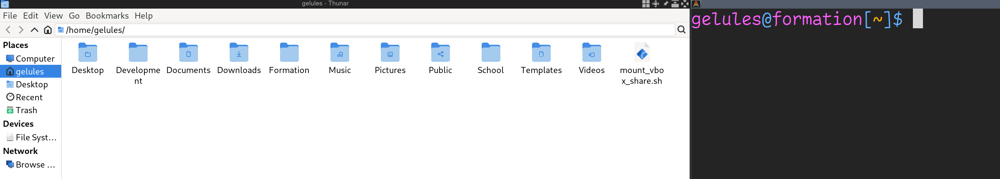
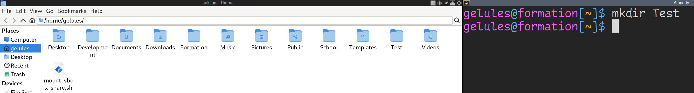
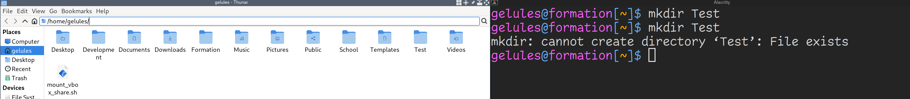
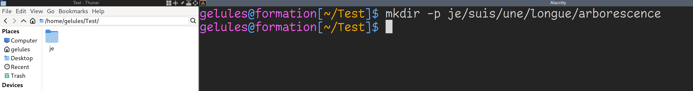
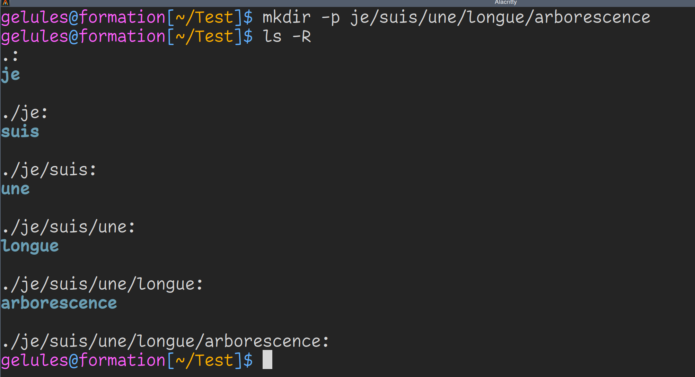
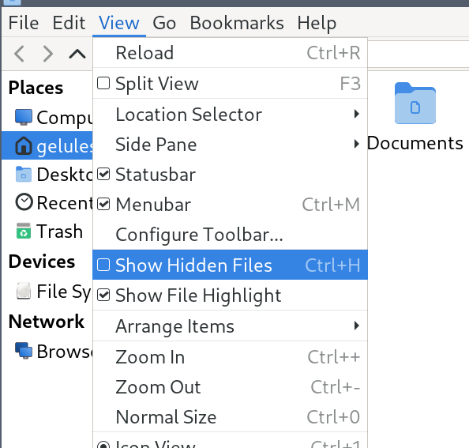

# Se déplacer

## Introduction

Maintenant que tu sais lire ce que t'affiche ton shell par défaut, tu vas
apprendre quelques manoeuvres de base.

Pour comprendre ce qu'il se passe, je te conseille d'ouvrir ton explorateur
graphique (le programme qui te permet de voir tes documents graphiquement) d'un
côté et ton shell de l'autre côté. Ca te permettra de faire le lien entre ce
que tu tapes et ce qu'il se passe dans ton système à chaque commande.

Ton explorateur graphique ne ressemblera peut-être pas au mien qui est Thunar.
Et j'aurai probablement à certains endroits des fichiers que tu n'as pas.
Ce n'est pas grave.

Dans tous les cas tu verras des dossiers et des fichiers et tu devras
double-cliquer pour te déplacer. Qui a dit que Windows avait l'exclusivité du
clique ?

Je te conseille de faire les mêmes commandes que moi, pour que ça rentre ! Ne
fais pas que lire. L'apprentissage vient surtout par la pratique, même si c'est
jouer au miroir.



Tu vois que dans mon exemple, mon shell se trouve dans mon **HOME** et Thunar
aussi. La différence c'est que Thunar me liste directement tous mes fichiers.

## Lister un répertoire

Pour lister ton répertoire courant, utilises la commande **ls**.

```sh
$ ls
Desktop  Development  Documents  Downloads  Formation  mount_vbox_share.sh  Music  Pictures  Public  School  Templates  Videos
$
```

Tu peux donner un ou plusieurs noms de fichiers et répertoires à **ls** pour
lister leurs contenus.

Depuis ton HOME, exécute
```sh
ls Desktop Documents Downloads
```

Si ces répertoires n'existent pas chez toi, attends de savoir en créer pour
tester **ls** avec des noms de fichiers et répertoires donnés en paramètres.

## Créer un répertoire

Pour créer un répertoire, utilise la commande **mkdir**.

```sh
mkdir Test
```



Comme tu peux le voir, mon explorateur de fichiers s'est actualisé pour afficher
le nouveau répertoire. Utilise la commande **ls** dans ton terminal pour valider
que ton terminal le voit également.

Sache que tu peux créer plusieurs répertoires d'un coup en les donnant à **ls**.

```sh
$ mkdir Je suis un seul appel a mkdir

# Cache-cache

Il y a une dernière chose dont je ne t'ai pas parlé. Les fichiers cachés.
```

Les commandes shell ont pour habitude de ne rien afficher si tout se passe bien.
En cas d'erreur, un message s'affichera. Lis toujours tes messages, il ne faut
pas avoir peur. C'est justement une aide pour comprendre ce qu'il se passe.



Ici, j'ai voulu créer le répertoire **Test** alors qu'il existe déjà.

# Se déplacer dans un répertoire

Pour te déplacer dans un répertoire graphiquement, c'est facile, tu
doubles-cliques dessus.


Pour te déplacer dans un répertoire en terminal, c'est facile, tu utilises la
commande **cd**.

```sh
$ cd Test
```

Déplace toi dans le répertoire **Test**.


Ton shell affiche maintenant **~/Test**. Ca veut dire qu'il se situe dans le
répertoire **Test** lui-même situé dans ton **HOME**.

Tu peux créer une arborescence complète en donnant le paramètre **-p** à mkdir.

```sh
$ mkdir -p je/suis/une/longue/arborescence
$
```



## Créer des fichiers

Tu ne vas pas encore voir comment éditer des fichiers. Tu vas commencer par
créer des fichiers vides.

Pour se faire, utilise la commande **touch**.

```sh
$ touch je_suis_un_fichier
$ ls
```

# Listing long format

Jusqu'ici tu as dû voir les différences entre fichier et répertoire aux couleurs
affichées sur le terminal avec **ls**. Cette coloration est dûe à une
configuration de **ls**.

Dans mon cas, si j'exécuter **which ls** pour en savoir plus sur la commande
**ls**, j'ai ceci :

```sh
$ which ls
ls: aliased to ls --color=auto
$
```

Ca veut dire que **ls** utilise par défaut le paramètre **--color=auto** qui
colore les noms des fichiers et répertoires dans ton terminal.

Exécute maintenant ceci, je fais exprès de cacher certains informations pour te
forcer à exécuter les commandes :
```sh
$ ls
$ mkdir repertoire
$ touch fichier
$ /bin/ls
repertoire fichier
$
```

Tu vois maintenant que tout s'affiche en blanc. Ce que tu as fait, c'est
exécuter le programme **ls** directement depuis là où il est installé, sans la
configuration de coloration automatique de ton shell.

Imagine tomber un jour sur une distribution Linux qui n'affiche pas les couleurs
par défaut, comment savoir si ce que tu listes et un fichier ou un répertoire ?

Tu vas utiliser le paramètre **-l** à **ls** pour afficher le *long listing
format*, pour afficher plein d'informations sur le répertoire où tu te trouves.

Exécute
```sh
$ ls -l
total 0
-rw-r--r-- 1 gelules wheel  0 Jul 20 18:56 fichier
drwxr-xr-x 2 gelules wheel 40 Jul 20 18:55 repertoire
```

La première ligne indique combien de place sur le disque prend ce que tu listes.
Pour l'instant c'est 0 car c'est vide.

Mainenant, pour chaque ligne, regarder le tout premier caractère. Si c'est un
tirer '-', c'est que tu listes un fichier, si c'est un 'd' minuscule, c'est que
c'est un répertoire.

Tu apprendras le reste des informations listées dans un prochain chapitre.

## Lister récursivement

Pour atteindre graphiquement la fin de l'arborescence, ça demande quelques
clics. Alors que pour le shell, il suffit de donner le paramètre **-R** à ls
pour lui demander de lister **récursivement** les répertoires.



Pour information, le '.' situé au début de chaque résultat représente ton
dossier courant (le *working directory*). Ca veut dire que si tu fais la
commande

```sh
$ cd .
```

Tu te déplaceras... où tu te trouves.

J'ai un exemple pratique qui sera présenté plus tard.

## Supprimer des fichiers et répertoires

Pour supprimer des répertoires, il existe deux commandes. **rmdir* et **rm**.

**rmdir** va supprimer un répertoire **vide** et **rm** avec les bons paramètres
va supprimer un répertoire et toute son arborescence récursivement.

Essaie le commandes suivantes, je n'affiche pas le résultat pour te forcer à
visualiser par toi-même ce qu'il se passe.

```sh
$ ls
je je_suis_un_fichier
$ rmdir je_suis_un_fichier
??? # Mais diantre, que se passe t-il ?
$ rm je_suis_un_fichier
$ ls
je
$ ls -R
.:
je

./je:
suis

./je/suis:
une

./je/suis/une:
longue

./je/suis/une/longue:
arborescence

./je/suis/une/longue/arborescence:
$ rmdir je
??? # Mais diantre, que se passe t-il ?
$ rmdir je/suis/une/longue/arborescence
$ ls -R
???
$ rm -r je
$ ls -R
$
```

Tu l'as compris, le paramètre **-r** de **rm** supprime toute une arborescence.

**rm** peut aussi être utilisé pour supprimer des fichiers, mais nous n'avons
pas encore vu ce cas.

Tu peux également donner plusieurs répertoires à **rmdir** et **rm** pour en
supprimer plusieurs. Attention, **rm** doit toujours avoir son paramètre **-r**
si tu supprimes des répertoires. Dans le cas de fichiers, tu n'as pas besoin de
l'utiliser.

```sh
$ rmdir Je suis un seul appel a mkdir
```

ou

```sh
$ rm -r Je suis un seul appel a mkdir
```

## Copier des fichiers et répertoires

Pour copier des fichiers et des répertoires, tu peux utiliser la commande
**cp**.

```sh
$ ls
$ touch fichier_1
$ cp fichier_1 fichier_2
$ mkdir repertoire_1
$ cp fichier_1 fichier_2 repertoire_1
$ cp -r repertoire_1 repertoire_2
$ ls
fichier_1  fichier_2  repertoire_1  repertoire_2
$ ls repertoire_1 repertoire_2
repertoire_1:
fichier_1  fichier_2

repertoire_2:
fichier_1  fichier_2
$ mkdir repertoire_3
$ cp -r repertoire_1 repertoire_2 repertoire_3
$ ls repertoire_3
repertoire_1  repertoire_2
$
```

Comme tu peux le constater, si tu veux copier un répertoire, il faut le faire
récursivement avec l'option **-r**.

## Renommer des fichiers et répertoires

Pour renommer ou déplacer un répertoire ou un fichier, utilise la commande
**mv**, pour *M*o*V*e.

```sh
$ touch gato
$ ls
gato
$ mv gato gateau
$ ls
gateau
$ mkdir ventre
$ mv gateau ventre
$ ls
ventre
$ ls ventre
gateau
$
```

En réalité quand tu *renommes* un fichier, tu le déplaces dans le même
répertoire avec un nouveau nom.

## cd en arrière

Tu sais avancer dans des répertoires, mais comment revenir en arrière ?

Il faut donner **..** à cd pour revenir en arrière. Chaque **..** part en
arrière d'un niveau.

Un exemple sera plus parlant.

```sh
$ mkdir -p toto/titi/tutu
$ cd toto/titi/tutu
$ cd ..
$ ls
tutu
$ cd ../..
$ ls
toto
$
```

## Retourner au dernier répertoire visité avec cd

Si tu veux basculer vers le dernier répertoire visité, donne **-** en paramètre
à **cd**.

Je te laisse faire les commandes pour apprécier, j'ai caché exprès les parties
intéressantes.

```sh
$ mkdir -p je/suis/un/humain tu/es/un/gateau
$ cd je/suis/un/humain
$ cd ../../../tu/es/un/gateau
$ pwd
???
$ cd -
$ pwd
???
$ cd -
$ pwd
???
$
```

## Retourner dans le HOME avec cd

Si tu veux retourner rapidement dans ton **HOME**, tu peux le faire en appellant
simplement **cd** sans paramètre.

Je te laisse faire les commandes pour apprécier, j'ai caché exprès les parties
intéressantes.

```sh
$ cd je/suis/un/humain
$ pwd
???
$ cd
$ pwd
???
$
```

### Cas particuliers
Crée le répertoire **canare** et **cd** y toi dedans.

```sh
~ $ mkdir canare
~ $ cd canare
~/canare $
```

Tu te rends compte que tu as fait une faute de frappe.

Renomme le répertoire dans lequel tu te trouves ainsi :
```sh
~/canare $ mv ../canare ../canard
~/canare $
```

Horreur et damnation, ton shell affiche encore **canare**. Il faut que tu
exécutes **cd .** pour que ton shell se mette à jour.

```sh
~/canare $ cd .
~/canard $
```

Maintenant plus drôle. Tu vas créer ce qu'on appelle un **undefined behavior**
ou **comportement indéfini**.

Voici quelques commandes :
```sh
$ mkdir toto
$ cd toto
$ rmdir ../toto
$ cd .
$ pwd
```
Que se passe t-il ? Tout dépend de ton shell, certains feront avec à leur
manière, d'autres afficheront une erreur. C'est un comportement indéfini, le
langage shell n'a pas défini quoi faire dans ce cas, chaque interpréteur a un
comportement différent.

## Le système de fichier

Tu l'as peut-être vu en exécutant la commande **pwd**, ton chemin commence
**toujours** par un slash '/'.

Ton **HOME** se trouve dans un autre répertoire appelé **home** qui se trouve
lui-même dans un répertoire nommé **/** (slash).

Exécute la commande **ls /** pour voir ce qui se trouve à la racine de ton
système de fichier (filesystem).

```sh
$ ls /
bin  boot  dev  etc  home  lib  lib64  lost+found  media  mnt  opt  proc  root  run  sbin  srv  sys  tmp  usr  var
```

Tu n'as peut-être pas exactement le même résultat. Ce n'est pas grave. Tu
devrais quand même y voir des similarités.

Pour les utilisateurs Windows, le répertoire racine est **un peu** équivalent au
disque C qui contient tous les répertoires de configuration. C'est faux sur
beaucoup d'aspects techniques que tu n'as pas encore besoin de connaître. Je
veux juste que tu saches qu'il existe un répertoire racine depuis lequel tu peux
te déplacer et lister ce qu'il s'y trouve.

Si jamais tu dois faire des tests temporaires, je te renvoie au répertoire
**/tmp** qui est, dans beaucoup de distributions Linux, remis à zéro à chaque
démarrage. Il peut être configuré pour être remis à zéro tous les jours,
semaines, mois...

```sh
$ cd /tmp
$ touch je_vais_disparaitre
$ ls
je_vais_disparaitre
$ reboot
...
$ cd /tmp
$ ls
```

# Cache-cache

Il y a une dernière chose dont je ne t'ai pas parlé. Les fichiers cachés.

Je vais exprès de cacher certains informations pour te forcer à pratiquer.

Exécute ces commandes depuis ton **HOME** :
```sh
$ mkdir Test
$ cd Test
$ touch .cache affiche
$ ls
???
$
```

Où est le fichier **.cache** ? Il est **caché**. Les fichiers et répertoires
dont le nom commencent par un point '.' ne sont pas affichés, car il s'agit en
général de fichier de configuration personnelle pour tes programmes et c'est
plus élégant de ne pas toujours les afficher.

Si tu veux les afficher, exécute :
```sh
$ ls -a
. .. .cache affiche
```

Mais que sont '.' et '..' ? Rappelle toi, le '.' représente le répertoire dans
lequel tu te trouves et '..' représente le répertoire parent. 

Si tu veux afficher tout ce qui est caché sauf '.' et '..', exécute :
```sh
$ ls -A
.cache affiche
```

Je te laisse maintenant exécuter cette dernière commande **dans ton HOME**. Tu
verras que même ton explorateur graphique ne t'affiche pas tout par défaut (mais
c'est configurable).


